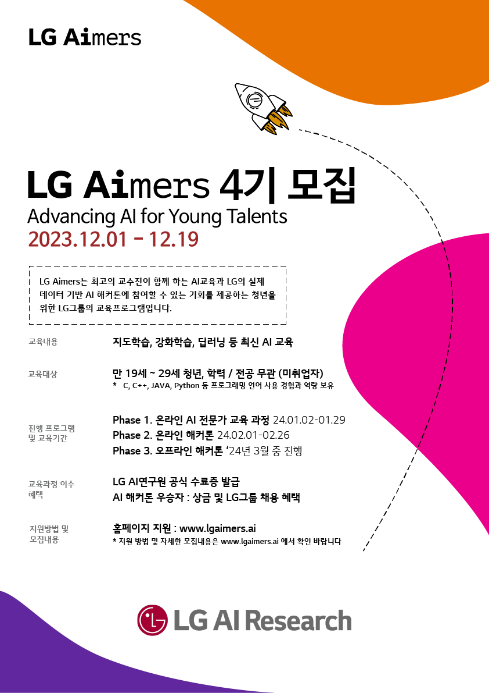

# LG AIMERS 4기

    

## MQL 데이터 기반 B2B 영업기회 창출 예측 모델 개발
[PDF 발표자료_3시49분_미팅룸에서...(Table_No.2)](LG_Aimers_4기_팀_3시49분_미팅룸에서...(Table_No.2).pdf)
_페이지_01.jpg)
_페이지_02.jpg)
_페이지_03.jpg)
_페이지_04.jpg)
_페이지_05.jpg)
_페이지_06.jpg)
_페이지_07.jpg)
_페이지_08.jpg)
_페이지_09.jpg)
_페이지_10.jpg)
_페이지_11.jpg)
_페이지_12.jpg)
_페이지_13.jpg)
_페이지_14.jpg)
_페이지_15.jpg)

## 팀원
- [김상희](https://github.com/cecksh) (성균관대학교 시스템경영공학과 품질공학연구실)
- [변유정](https://github.com/HBHBYJYJ) (성균관대학교 시스템경영공학과 정보과학연구실)
- [부도현](https://github.com/DohyunBu) (성균관대학교 시스템경영공학과 정보과학연구실)
- [소유림](https://github.com/sosum22) (성균관대학교 시스템경영공학과 데이터마이닝연구실)

